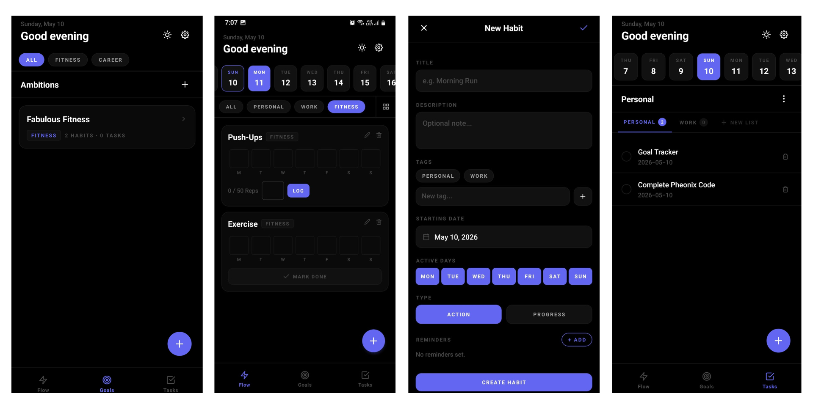

# Pheonix

Habit tracking mobile application built in React Native using Claude AI. I do not know how to code in React Native — I wanted to build a fully functioning app using AI assistance alone.

## Screenshots


## About

Pheonix is a personal productivity app organized around three ideas: daily habits (Flow), long-term ambitions (Goals), and one-off execution items (Tasks). Everything is stored locally on the device — no account, no backend, no internet required.

## Features

**Flow — Habit Tracking**
- Create habits with a title, description, tags, start date, and active days (Mon–Sun)
- Two habit types: Action (done or not done) and Progress (numeric target, e.g. 8 glasses of water)
- Multiple daily reminders per habit via device notifications
- 7-day mini heatmap on each card showing recent consistency
- Toggle to monthly heatmap view for a broader picture
- Habit detail screen shows current streak, best streak, 30-day completion rate, and a 14-day line chart for progress-type habits
- Date filter bar to view habits scheduled for any specific day
- Tag filter bar to narrow habits by category
- "All" view bypasses date and tag filters to show every habit

**Goals — Ambition Tracking**
- Create goals with a title, description, category, start date, optional end date, and reminders
- Link any number of habits and tasks to a goal (many-to-many)
- Goal detail shows all linked habits and tasks with the ability to unlink them
- Category filter bar to group and browse goals by type
- Categories are fully user-managed: create, rename, delete from Settings

**Tasks — Task Management**
- Google Tasks-style list organization: tasks belong to a named list
- Each task has a title, description, date, optional time, and optional goal link
- Lists (groups) are fully user-managed: create, rename, delete
- Date filter bar to view tasks for a specific day
- "All" view shows every task across all lists and all dates so nothing gets lost
- Tasks sort automatically: pending before completed, earlier dates first

**General**
- Dark and light theme, toggled from the header on any main screen
- All data persisted locally using AsyncStorage — no data loss on app update
- Confirmation dialogs before any destructive action (delete habit, task, goal, tag, list)
- Settings screen to manage habit tags, goal categories, and task lists — add, rename, delete

## Tech Stack

- React Native with Expo SDK 51
- React Navigation (Native Stack + Bottom Tabs)
- Zustand for state management
- AsyncStorage for local persistence
- react-native-svg for heatmap and line charts
- expo-notifications for habit reminders
- react-native-reanimated and react-native-gesture-handler
- react-native-safe-area-context and react-native-screens

## Project Structure

```
Pheonix/
├── App.js
├── app.json
├── babel.config.js
├── package.json
└── src/
    ├── theme/
    │   ├── colors.js
    │   ├── typography.js
    │   └── index.js
    ├── store/
    │   ├── habitStore.js
    │   ├── goalStore.js
    │   ├── taskStore.js
    │   ├── tagStore.js
    │   └── themeStore.js
    ├── hooks/
    │   ├── useTheme.js
    │   └── useAppInit.js
    ├── utils/
    │   ├── dateUtils.js
    │   ├── streakUtils.js
    │   ├── storage.js
    │   └── notificationUtils.js
    ├── navigation/
    │   ├── RootNavigator.js
    │   └── TabNavigator.js
    ├── components/
    │   ├── common/
    │   │   ├── AppText.js
    │   │   ├── AppButton.js
    │   │   ├── TagPill.js
    │   │   ├── EmptyState.js
    │   │   ├── ScreenHeader.js
    │   │   ├── HomeHeader.js
    │   │   ├── DateFilterBar.js
    │   │   └── DateTimeInput.js
    │   └── habits/
    │       ├── HabitCard.js
    │       ├── WeekHeatmap.js
    │       ├── MonthHeatmap.js
    │       └── ProgressChart.js
    └── screens/
        ├── FlowScreen.js
        ├── HabitDetailScreen.js
        ├── CreateHabitScreen.js
        ├── GoalsScreen.js
        ├── GoalDetailScreen.js
        ├── CreateGoalScreen.js
        ├── TasksScreen.js
        ├── CreateTaskScreen.js
        └── SettingsScreen.js
```

## Getting Started

Install dependencies:

```bash
npm install
```

Start the development server:

```bash
npx expo start
```

Scan the QR code with the Expo Go app (Android or iOS). If you are on the same WiFi network as your computer, it will load directly. If not, run with tunnel mode:

```bash
npx expo start --tunnel
```

## Building the App

### Using Expo Go (no build required)

Scan the QR code from `npx expo start`. This is the fastest way to run the app but device notifications will not fire — they require a proper build.

### Development Build — With Android Studio

Ensure Android Studio is installed with an emulator configured or a physical device connected via USB with USB debugging enabled. Then run:

```bash
npx expo run:android
```

For iOS (requires a Mac with Xcode):

```bash
npx expo run:ios
```

This compiles a full native build with all features including notifications.

### Production APK — Without Android Studio (EAS Build)

Install the EAS CLI:

```bash
npm install -g eas-cli
```

Log in to your Expo account (free):

```bash
eas login
```

Configure the build:

```bash
eas build:configure
```

Build an APK for Android (runs on Expo's cloud servers, no Android Studio needed):

```bash
eas build --platform android --profile preview
```

When the build finishes, you will get a download link for the APK. Install it directly on your Android device. This build includes full notification support.

For iOS you will need an Apple Developer account ($99/year). If you have one:

```bash
eas build --platform ios
```

### Local APK Without Android Studio (alternative)

If you have Java installed but not Android Studio, you can use Expo's local build:

```bash
npx expo export
```

This creates a static bundle. A full APK still requires the Android SDK. EAS Build above is the recommended path for building without Android Studio.

## Notes

- All data is stored on-device. Uninstalling the app deletes all data. App updates do not affect stored data.
- Notifications require a development build or production build. They do not fire in Expo Go.
- The app is JavaScript only — no TypeScript.
- Tested on Android. iOS behavior should be equivalent but is untested.
